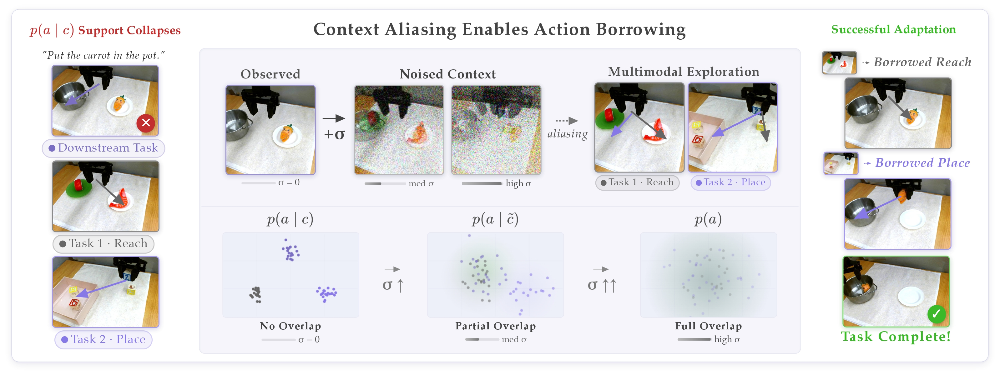

<div align="center">

<div id="user-content-toc">
  <ul align="center" style="list-style: none;">
    <summary>
      <h1>TMRL: Diffusion Timestep-Modulated Pretraining Enables Exploration for Efficient Policy Finetuning</h1>
      <h2>
        <a href="https://arxiv.org/abs/2605.12236v1">Paper</a> &emsp;
        <a href="https://weirdlabuw.github.io/tmrl">Website</a> &emsp;
      </h2>
    </summary>
  </ul>
</div>



</div>


## Setup

### Prerequisites

- **Python 3.11** (required by the `tmrl_openpi` submodule)
- [**uv**](https://docs.astral.sh/uv/getting-started/installation/)
- CUDA 12.x (for JAX and PyTorch GPU support)

### 1. Clone the repo with submodules

```bash
git clone --recurse-submodules git@github.com:matthewh6/tmrl.git
cd tmrl

# Or if you already cloned the repo:
git submodule update --init --recursive
```

### 2. Create the environment and install dependencies

```bash
uv venv --python 3.11
GIT_LFS_SKIP_SMUDGE=1 uv sync
source .venv/bin/activate

# Apply the transformers library patches:
uv pip install transformers==4.53.2
cp -r tmrl_openpi/src/tmrl_openpi/models_pytorch/transformers_replace/* .venv/lib/python3.11/site-packages/transformers/
```

This single `uv sync` installs both `tmrl_openpi` (JAX, flax, openpi) and all `tmrl` deps into one `.venv` at the project root.

### 3. Install OGBench/LIBERO for sim experiments

```bash
cd ogbench
uv pip install -e .
cd ..
cd LIBERO_PRO
uv pip install -r requirements.txt
uv pip install -e .
cd ..
export PYTHONPATH=./LIBERO_PRO:$PYTHONPATH
```

### 4. Download the pretrained VLA checkpoints

The high-level RL commands below load a pretrained VLA via `ckpt=<name>`, which
resolves to `checkpoints/<name>`. Download the context-smoothed (`cspi`) VLA from the
Hugging Face Hub into `checkpoints/`:

```bash
pip install -U "huggingface_hub[cli]"   # provides the `hf` CLI

# real-world WidowX / Bridge prior (used by: sac_robot.py dataset=widowx)
hf download matthewh6/cspi0_bridge --repo-type model --local-dir checkpoints/cspi0_bridge

# LIBERO prior (used by: sac_libero.py)
hf download matthewh6/cspi0_libero --repo-type model --local-dir checkpoints/cspi0_libero
```

Each checkpoint is loaded by name in `tmrl/utils/common.py:load_pi0_model`, which maps `cspi*`
priors to the timestep-modulated `CSPi0` architecture. The default cache root is `~/.cache/openpi`;
override it with `OPENPI_DATA_HOME` if you keep assets elsewhere.

## Low-level policy pre-training (OGBench)
<details>
<summary><b>Click to expand the full list of commands</b></summary>

## Context-smoothed policy (TMRL)
```bash
# pointmaze
python3 train.py model=nfp dataset=pointmaze-large

# cube
python3 train.py model=ngcfp dataset=cube
```

## Flow policy (DSRL)
```bash
# pointmaze
python3 train.py model=fp dataset=pointmaze-large

# cube
python3 train.py model=gcfp dataset=cube
```
</details>

## High-level RL training

<details>
<summary><b>Click to expand the full list of commands</b></summary>

### Timestep-modulated reinforcement learning (TMRL)

```bash
# pointmaze
python3 sac_ogbench.py dataset=pointmaze-giant method=tmrl ckpt=/path/to/nfp

# cube
python3 sac_ogbench.py dataset=cube method=tmrl ckpt=/path/to/ngcfp

# libero-90
python3 sac_libero.py dataset=libero_90 method=tmrl ckpt=cspi0_libero

# libero-goal
python3 sac_libero.py dataset=libero_goal perturbation=task method=tmrl ckpt=cspi0_libero

# widowx
python3 sac_robot.py dataset=widowx method=tmrl ckpt=cspi0_bridge

# droid
python3 sac_robot.py dataset=droid method=tmrl ckpt=cspi0_droid
```

### Diffusion steering via reinforcement learning (DSRL)

```bash
# pointmaze
python3 sac_ogbench.py dataset=pointmaze-giant method=dsrl ckpt=/path/to/fp

# cube
python3 sac_ogbench.py dataset=cube method=dsrl ckpt=/path/to/gcfp

# libero-90
python3 sac_libero.py dataset=libero_90 method=dsrl ckpt=pi0_libero

# libero-goal
python3 sac_libero.py dataset=libero_goal perturbation=task method=dsrl ckpt=pi0_libero

# widowx
python3 sac_robot.py dataset=widowx method=dsrl ckpt=pi0_bridge

# droid
python3 sac_robot.py dataset=droid method=dsrl ckpt=pi0_droid
```
</details>

## Baseline methods

### RLPD

<details>
<summary><b>Click to expand the full list of commands</b></summary>

```bash
# pointmaze
python3 sac_ogbench.py dataset=pointmaze-giant method=rlpd actor_action_dim=7

# cube
python3 sac_ogbench.py dataset=cube method=rlpd actor_action_dim=7

# libero-90
python3 sac_libero.py dataset=libero_90 method=rlpd actor_action_dim=7

# libero-goal
python3 sac_libero.py dataset=libero_goal perturbation=task method=rlpd actor_action_dim=7
```
</details>

## Citation

```bibtex
@inproceedings{hong2026tmrl,
    title  = {TMRL: Diffusion Timestep-Modulated Pretraining Enables Exploration for Efficient Policy Finetuning},
    author = {Hong, Matthew M. and Zhang, Jesse and Nagabandi, Anusha and Gupta, Abhishek},
    booktitle = {Robotics: Science and Systems (RSS)},
    year   = {2026}
}
```
